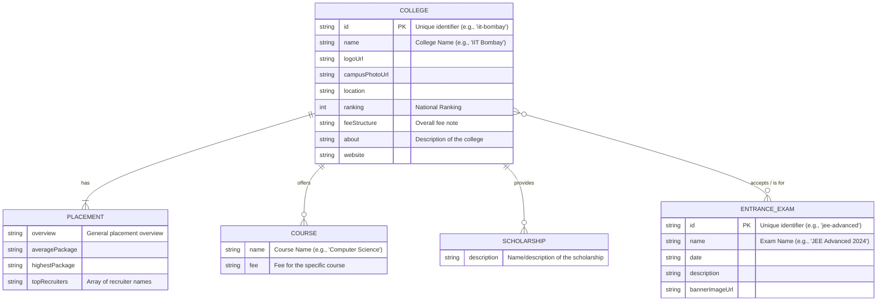

# EduCompare App - Entity-Relationship Diagram

This diagram outlines the logical data structure of the EduCompare application. It's based on the data types defined in `src/lib/types.ts`.

The current implementation in `src/lib/data.ts` uses a denormalized structure where Course, Placement, and Scholarship details are embedded within the College object. This ER diagram represents the normalized, logical relationships between these entities as they would exist in a relational database.

## Mermaid Diagram

### Relationships Explained:

*   **COLLEGE `||--|{` PLACEMENT**: One-to-One. Each college has one set of placement details.
*   **COLLEGE `||--o{` COURSE**: One-to-Many. Each college offers many courses.
*   **COLLEGE `||--o{` SCHOLARSHIP**: One-to-Many. Each college provides many scholarships.
*   **COLLEGE `}o--o{` ENTRANCE_EXAM**: Many-to-Many. A college can accept scores from multiple exams, and an exam is relevant for multiple colleges.
